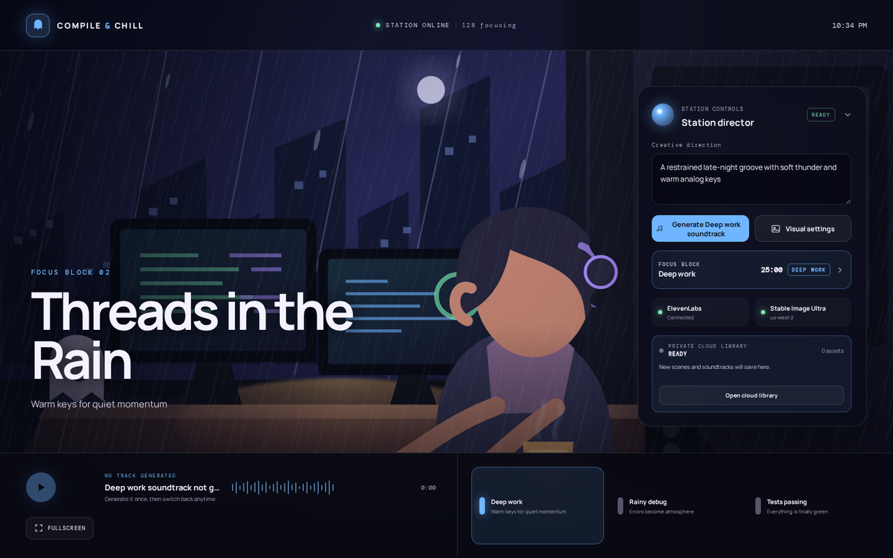
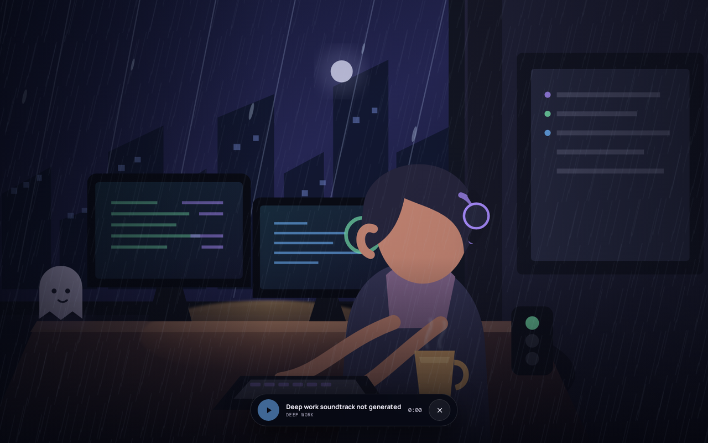

# Compile & Chill FM

An autonomous lo-fi radio station for developers, built with Nuxt. It generates its own
artwork and its own music: a cozy "rainy developer" scene from Amazon Bedrock, a seamless
60-second instrumental loop from ElevenLabs, and — optionally — a six-second animated video
loop of the scene so the character keeps typing while you work.

The UI runs immediately with the bundled placeholder artwork. Each generation provider is
independent and opt-in: add only the credentials for the features you want.



Fullscreen scene mode, with the auto-hiding control bar. The bar fades out after three seconds
of no input and returns on any tap or mouse move:



## Features

- **Three station modes** — Deep Work, Rainy Debug, Tests Passing. Each keeps its own
  generated scene and soundtrack.
- **Two scene types**
  - *Realistic static* — a cinematic 16:9 still from Stability AI Stable Image Ultra via
    Amazon Bedrock.
  - *Illustrated animated* — a private six-second silent MP4 loop. The same illustration is
    used as the video's first **and** last frame, so it loops without a visible snap.
- **Self-hosted music** — ElevenLabs Music v2, generated in loop mode with a no-outro prompt
  so the track repeats at musical loop points.
- **Fullscreen scene mode** — the artwork fills the screen with an auto-hiding control bar
  (play/pause, elapsed, exit). Escape always exits.
- **Focus Block** — a browser-local Pomodoro timer: 25-minute focus, 5-minute breaks, and a
  15-minute long break after four blocks.
- **Private media library** — generated media is stored in your own S3 bucket, bound to your
  browser by an opaque cookie, and streamed back through same-origin routes.
- **Stream Deck control** — plain HTTP endpoints for switching modes and triggering generation.
- **No credential ever reaches the browser.** No API key, no AWS credential, no bucket name,
  no S3 URL.

## Requirements

| Requirement | Notes |
| --- | --- |
| Node.js 20+ | Nuxt 4 requires it |
| AWS account | For Bedrock image generation and the private S3 library |
| ElevenLabs API key | *Optional* — enables music generation |
| OpenRouter API key | *Optional* — enables animated scene loops |

Every provider is optional. With no credentials at all you still get the full UI, the
placeholder scene, the mode switcher, and Focus Block.

## Quick start

```bash
git clone https://github.com/<your-username>/compile-and-chill.git
cd compile-and-chill
npm install
cp .env.example .env
npm run dev
```

Open `http://127.0.0.1:8231`.

## Configuration

All configuration is server-side only. Copy `.env.example` to `.env` and fill in what you need.
**Never** prefix any of these with `NUXT_PUBLIC_`, which would expose them to the browser.

| Variable | Required for | Notes |
| --- | --- | --- |
| `ELEVENLABS_API_KEY` | Music | Create a restricted key under Developers → API Keys |
| `AWS_PROFILE` | Scenes, library | Prefer a profile over long-lived keys |
| `BEDROCK_IMAGE_REGION` | Scenes | Defaults to `us-west-2` |
| `BEDROCK_IMAGE_MODEL_ID` | Scenes | Defaults to `stability.stable-image-ultra-v1:1` |
| `STATION_S3_BUCKET` | Library, animated | Bucket name from the SAM stack output |
| `STATION_S3_REGION` | Library, animated | Defaults to `us-west-2` |
| `OPENROUTER_API_KEY` | Animated scenes | Enables the Seedance video loop path |
| `STATION_BIND_HOST` | Remote control | Defaults to `127.0.0.1` (loopback only) |
| `NUXT_CONTROL_TOKEN` | Remote control | Required if binding to a non-loopback address |

### Amazon Bedrock (scene generation)

Authenticate with your normal AWS CLI profile rather than putting access keys in `.env`:

```bash
aws sso login --profile your-profile
```

```dotenv
AWS_PROFILE=your-profile
BEDROCK_IMAGE_REGION=us-west-2
BEDROCK_IMAGE_MODEL_ID=stability.stable-image-ultra-v1:1
```

The identity needs `bedrock:InvokeModel`. Stable Image Ultra must be enabled in your account
for the chosen region — request access under **Bedrock → Model access**. Model availability
changes over time, so verify at runtime rather than assuming an older model ID still works.

### Private S3 library

Generated scenes and tracks are retained in a private, browser-bound station library. The
server writes objects with the AWS SDK and streams saved media back through same-origin
`/api/library/assets/*` routes, so the browser never learns the bucket name or sees an S3 URL.

Deploy the included template with AWS SAM:

```bash
sam validate --template-file infra/compile-and-chill-private-station.yaml --region us-west-2

sam deploy \
  --region us-west-2 \
  --stack-name compile-and-chill-private-station \
  --template-file infra/compile-and-chill-private-station.yaml \
  --no-confirm-changeset \
  --no-fail-on-empty-changeset
```

It provisions private versioned S3 storage with Block Public Access, bucket-owner-enforced
ownership, SSE-S3, an HTTPS-only policy, a seven-day noncurrent-version lifecycle rule,
KMS-encrypted CloudTrail logs for S3 data events, and a CloudWatch alarm on delete requests.

Read the bucket name from the stack output:

```bash
aws cloudformation describe-stacks \
  --region us-west-2 \
  --stack-name compile-and-chill-private-station \
  --query "Stacks[0].Outputs[?OutputKey=='StationMediaBucketName'].OutputValue" \
  --output text
```

```dotenv
STATION_S3_BUCKET=the-command-output
STATION_S3_REGION=us-west-2
```

Run the server under a role scoped to that bucket and the `stations/*` prefix. Do not reuse an
administrator identity, and do not put long-lived AWS keys in `.env`.

**How persistence behaves.** The server sets an opaque, HttpOnly, SameSite cookie holding a
random station ID, so saved media is restored only by the same browser profile. Regenerating a
mode overwrites just that mode's asset; versioning protects against accidental replacement
until the lifecycle rule prunes old versions. In the app, *Clear this browser* drops only the
local reference, while *Delete saved station* requires typing `DELETE` and then purges every
object, manifest, delete marker, and retained version under that station's prefix — which
cannot be undone.

### Animated scene loops (OpenRouter)

```dotenv
OPENROUTER_API_KEY=your_key_here
```

Animated generation needs `STATION_S3_BUCKET` configured too, because the video provider must
fetch the anchor illustration over HTTPS. The flow is:

1. Generate a fresh illustrated anchor frame with Bedrock.
2. Store it privately and mint a **five-minute** presigned URL for it.
3. Submit a six-second, 720p, silent job using that image as both first and last frame.
4. Poll server-side, download the finished MP4, and save it to the private library.
5. Delete the temporary anchor object.

The presigned URL is never logged, never returned to the browser, and provider error text is
URL-redacted before it is surfaced anywhere.

> **This step spends money.** It requires an explicit confirmation in the UI and will not run
> accidentally. Model choice defaults to the cheapest capable option and falls back to other
> models only when a provider refuses the input image (a refusal creates no job and costs
> nothing). Credit and rate-limit errors stop immediately rather than retrying.

Some providers run a person-likeness classifier over input frames and may refuse an
illustration that reads as photographic. If that happens, regenerate the scene so it looks
flatter and more clearly hand-drawn.

## Agent skills

This project was built with [Kiro](https://kiro.dev) using agent skills — focused instruction
files that teach a coding agent a specific domain. `skills-lock.json` pins the exact upstream
source and content hash of every skill used, so you can reinstall the same set:

```bash
npx skills install
```

| Source | Count | Covers |
| --- | --- | --- |
| [`aws/agent-toolkit-for-aws`](https://github.com/aws/agent-toolkit-for-aws) | 16 | Bedrock, IAM, S3, SAM/serverless, observability, Secrets Manager, cost management, agent build/deploy/harden |
| [`vuejs-ai/skills`](https://github.com/vuejs-ai/skills) | 8 | Vue best practices, testing, router, Pinia, JSX, composables, debugging |
| [`elevenlabs/skills`](https://github.com/elevenlabs/skills) | 3 | Music generation, sound effects, API key setup |

The third-party skill *content* is intentionally not vendored here — it belongs to those
upstream projects and carries their licenses. The lockfile records what to fetch and verifies
it by hash.

One skill in this repo is original and specific to this project:

- **`skills/openrouter-video-loop/SKILL.md`** — the policy for generating a controlled,
  camera-locked illustrated video loop: require first/last frame support, keep the source URL
  private and short-lived, demand explicit confirmation before spending, and reject output that
  drifts the camera or changes the character.

`.kiro/settings/mcp.json` also configures the AWS MCP server used during development.

## Using it

1. Pick a station mode.
2. Edit the creative direction text if you want to steer the mood.
3. Open **Visual settings**, choose *Realistic static* or *Illustrated animated*, and generate.
4. Generate a soundtrack for the mode. Music is capped at 60 seconds server-side to limit spend.
5. Press **Fullscreen** in the player dock for the scene-only view.

Generated media is saved per mode and restored on your next visit from the same browser.

## Stream Deck control

The Stream Deck desktop app sends plain HTTP requests; the hardware never talks to the app
directly. The server is loopback-only unless you change `STATION_BIND_HOST`.

To control it from another machine, bind to a **private VPN interface address** — never
`0.0.0.0` and never a public IP — and set a long random token:

```dotenv
STATION_BIND_HOST=your-vpn-interface-address
NUXT_CONTROL_TOKEN=a-long-random-token
```

The server refuses to start if `STATION_BIND_HOST` is non-loopback while the token is blank.

Create an **HTTP Request** action per button:

```text
Method: POST
URL:    http://<your-host>:8231/api/control/mode
Header: Content-Type: application/json
Header: x-control-token: <your token>
Body:   {"mode":"deepWork"}
```

| Button | Endpoint | Body | Effect |
| --- | --- | --- | --- |
| Deep Work | `/api/control/mode` | `{"mode":"deepWork"}` | Switch mode |
| Rainy Debug | `/api/control/mode` | `{"mode":"rainyDebug"}` | Switch mode |
| Tests Passing | `/api/control/mode` | `{"mode":"testsPassing"}` | Switch mode |
| New Track | `/api/control/generate/music` | *(none)* | 60-second loop for the active mode |
| Random Scene | `/api/control/generate/scene` | *(none)* | New realistic static scene for the active mode |

Open the station in a browser once after starting the server — this registers the private
station ID that the control endpoints write into. The controls never return bucket names,
S3 keys, credentials, or media URLs.

**Troubleshooting.** A `401` means the token is missing or mistyped. A connection failure
usually means the action is not `POST`, the port is wrong, or the URL says `localhost` while
the server is bound to a VPN address. Note that a non-loopback binding genuinely stops serving
`http://localhost:8231` — that is expected, not a bug.

## Security notes

- Credentials live only in `.env`, which is git-ignored, and are read only by server routes.
- The browser receives no bucket name, no S3 URL, and no presigned URL.
- Remote control requires a token, and non-loopback binding without one is refused at startup.
- Provider error text is scrubbed of URLs before logging or display.
- This is a development server. Do not expose it through a public reverse proxy.

## Costs

Generation calls bill to your own accounts. Roughly: one Bedrock image per static scene, one
short video per animated scene (the default model is the cheapest capable option), and
ElevenLabs credits per 60-second track. Animated generation is the most expensive action and
is the only one gated behind an explicit confirmation.

## Commands

```bash
npm run dev        # development server on 127.0.0.1:8231
npm run build      # production build
npm test           # vitest
npm run typecheck  # vue-tsc
```

## Roadmap

- Strands-based station manager for autonomous programming blocks
- Ambience and station-ID mixing
- Queue-ahead worker with a known-good fallback loop
- Stream Deck plugin with current-mode feedback
- Image-to-image generation to keep the room and character consistent across scenes
